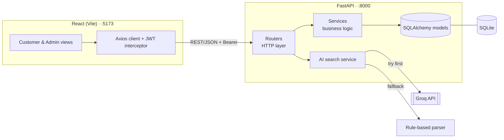
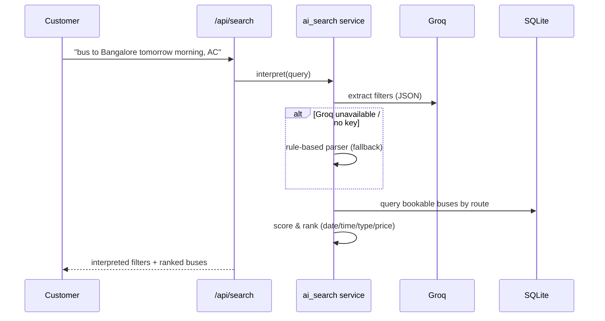

# KPi-Tech Bus Ticketing System — with AI-Powered Search

A full-stack bus ticketing platform with two roles (**Admin** and **Customer**)
and an **AI natural-language search**: a customer can type
_"I need a bus from Hyderabad to Bangalore tomorrow morning, preferably AC"_
and the system interprets it and returns matching, ranked, bookable buses.

> Built for the KPi-Tech Services AI Software Engineer assignment.

---

## 1. Tech stack

| Layer     | Choice                          | Why |
|-----------|---------------------------------|-----|
| Backend   | **FastAPI** (Python)            | Async, type-safe, auto-generated Swagger docs at `/docs` — great for a live demo. |
| ORM / DB  | **SQLAlchemy 2.0 + SQLite**     | Zero-setup single-file DB; the ORM keeps queries readable and portable to Postgres. |
| Auth      | **JWT** (python-jose) + **bcrypt** | Stateless tokens; passwords are only ever stored as bcrypt hashes. |
| AI search | **Groq** (OpenAI-compatible) + **rule-based fallback** | Groq parses the sentence into filters; a deterministic parser guarantees search still works with no API key / no network. |
| Frontend  | **React 18 + Vite**             | Fast dev server, component-based UI, industry standard. |
| Routing   | **React Router**                | Clean role-based navigation and route guards. |
| HTTP      | **Axios**                       | One configured client with a JWT interceptor. |

---

## 2. Features (mapped to the brief)

- **Admin — bus management:** create / edit / delete buses with route, departure
  time, type (AC / Non-AC / Sleeper), total seats, price, and active status.
- **Admin — dashboard:** bookings today, revenue (today + total), buses ranked by
  occupancy, and route-wise demand.
- **Customer — AI search:** natural-language query → interpreted filters → ranked
  results, each showing _why_ it matched.
- **Customer — booking flow:** pick a bus, enter passenger details, confirm; seat
  availability decreases immediately.
- **Booking status:** `Confirmed → Cancelled`; cancelling **releases seats back**.
- **Overbooking prevention:** a bus with 0 seats (or fewer than requested) is
  rejected by the API — enforced in the service layer, not just the UI.
- **RESTful API:** correct status codes (`201`, `204`, `400`, `401`, `403`,
  `404`, `409`) and consistent error messages.

---

## 3. Architecture



**Layered backend** keeps responsibilities separate and testable:

```
Request → Router (HTTP, auth, status codes)
        → Service (domain rules: overbooking, ranking, analytics)
        → Model (SQLAlchemy ORM)
        → SQLite
```

### AI search flow



---

## 4. Project structure

```
kpiTechProject/
├── backend/
│   ├── app/
│   │   ├── main.py              # FastAPI app, CORS, router mounting
│   │   ├── config.py            # env-driven settings (pydantic-settings)
│   │   ├── database.py          # engine, session, get_db dependency
│   │   ├── deps.py              # auth dependencies (current user, role guards)
│   │   ├── seed.py              # demo data (admin, customer, buses)
│   │   ├── core/security.py     # bcrypt hashing + JWT create/decode
│   │   ├── models/              # SQLAlchemy models (User, Bus, Booking) + enums
│   │   ├── schemas/             # Pydantic request/response contracts
│   │   ├── services/            # booking, ai_search, query_parser, dashboard
│   │   └── routers/             # auth, buses, bookings, search, admin
│   ├── requirements.txt
│   └── .env.example
└── frontend/
    ├── src/
    │   ├── api/client.js         # axios instance + endpoint wrappers
    │   ├── context/AuthContext.jsx
    │   ├── components/           # Navbar, BusCard, Modal, forms, route guard
    │   └── pages/                # LoginPage, RegisterPage, customer/, admin/
    ├── package.json
    └── .env.example
```

---

## 5. Setup & run

**Prerequisites:** Python 3.11+ and Node 18+.

### Backend

```powershell
cd backend
python -m venv .venv
.\.venv\Scripts\Activate.ps1          # macOS/Linux: source .venv/bin/activate
pip install -r requirements.txt
Copy-Item .env.example .env           # optional: add your GROQ_API_KEY
python -m app.seed                    # create tables + demo data
uvicorn app.main:app --reload         # http://localhost:8000  (docs at /docs)
```

### Frontend

```powershell
cd frontend
npm install
Copy-Item .env.example .env           # defaults to http://localhost:8000/api
npm run dev                           # http://localhost:5173
```

### Demo accounts (created by the seed script)

| Role     | Email                   | Password     |
|----------|-------------------------|--------------|
| Admin    | `admin@kpitech.com`     | `admin123`   |
| Customer | `customer@kpitech.com`  | `customer123`|

---

## 6. Enabling real Groq AI (optional)

The app runs fully without any API key using the rule-based parser. To use Groq,
put your key (free at https://console.groq.com) in `backend/.env`:

```
GROQ_API_KEY=gsk_...your-key...
GROQ_MODEL=llama-3.3-70b-versatile
```

The search response includes a `source` field (`"groq"` or `"rule-based"`) so you
can see which path was used — the UI shows it in the "AI understood" panel.

---

## 7. Key design decisions

- **Live `available_seats` counter on the bus.** Instead of counting bookings on
  every request, we keep a running count that is decremented on booking and
  restored on cancellation. Overbooking is then a single cheap check, and the
  booking + decrement happen in one transaction (`with_for_update()` locks the
  row on Postgres) so concurrent requests can't oversell the last seat.
- **Groq + deterministic fallback.** The demo must always run. If Groq is missing
  or errors, the rule-based parser takes over transparently — the feature never
  hard-fails.
- **Thin routers, fat services.** HTTP concerns (status codes, auth) live in
  routers; domain rules (overbooking, ranking, analytics) live in services. This
  keeps each file small and the logic unit-testable in isolation.
- **Schemas separate from models.** Pydantic schemas are the API contract and
  never expose internal fields like `hashed_password`.
- **Price snapshot on booking.** `total_price` is stored on the booking so later
  price edits don't rewrite historical revenue.

---

## 8. Assumptions

- Public sign-up creates **customers** only; the admin account is provisioned by
  the seed script (a realistic pattern for an internal admin).
- One booking targets a single bus and may reserve up to 10 seats; all seats share
  the same passenger record (kept simple for the assignment scope).
- "Revenue" counts only **Confirmed** bookings; cancellations are excluded.
- Times are handled as naive local datetimes for demo clarity.
- SQLite is used for zero-setup; the SQLAlchemy layer makes a Postgres swap a
  config change.

---

## 9. What I'd improve with more time

- Alembic migrations instead of `create_all`.
- Automated tests (pytest for the booking/overbooking rules and the ranking).
- Seat-level selection (specific seat numbers) and per-passenger details.
- Pagination and server-side filtering on the admin bus list.
- Refresh tokens + token expiry handling in the UI.
- Dockerfile + docker-compose for one-command startup.
```
